# YOLOv4-RCSOSA-SimAM 架构图

**描述**: RCS-OSA模块 + SimAM注意力机制 + IDetect检测头

## 📊 模型参数

- **类别数**: 2
- **深度倍数**: 1.0
- **宽度倍数**: 0.75
- **锚点配置**: 2 组
  - P4: [37, 49, 89, 110]
  - P5: [177, 372, 249, 110]

## 🏗️ 网络架构

```mermaid
flowchart TD

    title["YOLOv4-RCSOSA-SimAM<br/>RCS-OSA模块 + SimAM注意力机制 + IDetect检测头"]

    Input["Input Image<br/>640×640×3"]

    %% Backbone
    Conv0["Conv\n64ch\nk=3, s=2"]
    Conv1["Conv\n128ch\nk=3, s=2"]
    RCSOSA2["RCS-OSA\n128ch"]
    Conv3["Conv\n256ch\nk=3, s=2"]
    RCSOSA4["RCS-OSA\n256ch"]
    Conv5["Conv\n512ch\nk=3, s=2"]
    RCSOSA6["RCS-OSA\n512ch"]
    SimAM7["SimAM\nAttention"]
    Conv8["Conv\n1024ch\nk=3, s=2"]
    RCSOSA9["RCS-OSA\n1024ch"]
    SimAM10["SimAM\nAttention"]
    SPPF11["SPPF\n1024ch\nk=5"]

    %% Head
    Conv12["Conv\n512ch\nk=1, s=1"]
    nn.Upsample13["Upsample\n×2"]
    RCSOSA14["RCS-OSA\n512ch"]
    Concat15["Concat\nFeature Fusion"]
    RCSOSA16["RCS-OSA\n512ch"]
    Conv17["Conv\n512ch\nk=3, s=2"]
    Concat18["Concat\nFeature Fusion"]
    RCSOSA19["RCS-OSA\n768ch"]
    Conv20["Conv\n512ch\nk=3, s=1"]
    Conv21["Conv\n768ch\nk=3, s=1"]
    SimAM22["SimAM\nAttention"]
    IDetect23["IDetect\nClasses: nc"]

    Output["Detection Results<br/>Bounding Boxes + Classes"]

    %% Connections
    Input --> Conv0
    Conv0 --> Conv1
    Conv1 --> RCSOSA2
    RCSOSA2 --> Conv3
    Conv3 --> RCSOSA4
    RCSOSA4 --> Conv5
    Conv5 --> RCSOSA6
    RCSOSA6 --> SimAM7
    SimAM7 --> Conv8
    Conv8 --> RCSOSA9
    RCSOSA9 --> SimAM10
    SimAM10 --> SPPF11
    SPPF11 --> Conv12
    Conv12 --> nn.Upsample13
    nn.Upsample13 --> RCSOSA14
    RCSOSA14 --> Concat15
    Concat15 --> RCSOSA16
    RCSOSA16 --> Conv17
    Conv17 --> Concat18
    Concat18 --> RCSOSA19
    RCSOSA19 --> Conv20
    Conv20 --> Conv21
    Conv21 --> SimAM22
    SimAM22 --> IDetect23
    IDetect23 --> Output

    %% Styling
    classDef inputStyle fill:#FFF9C4,stroke:#F57F17,stroke-width:3px,color:#000
    classDef outputStyle fill:#FFCDD2,stroke:#C62828,stroke-width:3px,color:#000
    class Input inputStyle
    class Output outputStyle
    classDef convStyle fill:#E1F5FE,stroke:#01579B,stroke-width:2px,color:#000
    classDef rcsosaStyle fill:#FFF3E0,stroke:#E65100,stroke-width:2px,color:#000
    classDef simamStyle fill:#FFEBEE,stroke:#B71C1C,stroke-width:2px,color:#000
    classDef sppfStyle fill:#F0F4C3,stroke:#827717,stroke-width:2px,color:#000
    classDef upsampleStyle fill:#E0F2F1,stroke:#00695C,stroke-width:2px,color:#000
    classDef concatStyle fill:#F5F5F5,stroke:#424242,stroke-width:2px,color:#000
    classDef idetectStyle fill:#FCE4EC,stroke:#AD1457,stroke-width:2px,color:#000
    class Conv0 convStyle
    class Conv1 convStyle
    class RCSOSA2 rcsosaStyle
    class Conv3 convStyle
    class RCSOSA4 rcsosaStyle
    class Conv5 convStyle
    class RCSOSA6 rcsosaStyle
    class SimAM7 simamStyle
    class Conv8 convStyle
    class RCSOSA9 rcsosaStyle
    class SimAM10 simamStyle
    class SPPF11 sppfStyle
    class Conv12 convStyle
    class nn.Upsample13 upsampleStyle
    class RCSOSA14 rcsosaStyle
    class Concat15 concatStyle
    class RCSOSA16 rcsosaStyle
    class Conv17 convStyle
    class Concat18 concatStyle
    class RCSOSA19 rcsosaStyle
    class Conv20 convStyle
    class Conv21 convStyle
    class SimAM22 simamStyle
    class IDetect23 idetectStyle
```




## 📈 模块统计

| 模块类型 | 数量 | 描述 |
|---------|------|------|
| Concat | 2 | 特征拼接 |
| Conv | 9 | 标准卷积层 |
| IDetect | 1 | 检测头 |
| RCSOSA | 7 | RCS-OSA模块 |
| SPPF | 1 | 空间金字塔池化 |
| SimAM | 3 | SimAM注意力机制 |
| nn.Upsample | 1 | 上采样层 |
| **总计** | **24** | **总层数** |

## 🔧 Backbone详细结构

| 层序号 | 模块类型 | 参数 | 描述 |
|-------|---------|------|------|
| 0 | Conv | [64, 3, 2] | 来自: -1 |
| 1 | Conv | [128, 3, 2] | 来自: -1 |
| 2 | RCSOSA | [128] | 来自: -1 |
| 3 | Conv | [256, 3, 2] | 来自: -1 |
| 4 | RCSOSA | [256] | 来自: -1 |
| 5 | Conv | [512, 3, 2] | 来自: -1 |
| 6 | RCSOSA | [512, True] | 来自: -1 |
| 7 | SimAM | 无 | 来自: -1 |
| 8 | Conv | [1024, 3, 2] | 来自: -1 |
| 9 | RCSOSA | [1024, True] | 来自: -1 |
| 10 | SimAM | 无 | 来自: -1 |
| 11 | SPPF | [1024, 5] | 来自: -1 |

## 🎯 Head详细结构

| 层序号 | 模块类型 | 参数 | 描述 |
|-------|---------|------|------|
| 12 | Conv | [512, 1, 1] | 来自: -1 |
| 13 | nn.Upsample | ['None', 2, 'nearest'] | 来自: -1 |
| 14 | RCSOSA | [512] | 来自: -1 |
| 15 | Concat | [1] | 来自: [-1, 6] |
| 16 | RCSOSA | [512] | 来自: -1 |
| 17 | Conv | [512, 3, 2] | 来自: -1 |
| 18 | Concat | [1] | 来自: [-1, 10] |
| 19 | RCSOSA | [768] | 来自: -1 |
| 20 | Conv | [512, 3, 1] | 来自: 14 |
| 21 | Conv | [768, 3, 1] | 来自: 17 |
| 22 | SimAM | 无 | 来自: [18, 19] |
| 23 | IDetect | ['nc', 'anchors'] | 来自: [20] |

## 💡 使用说明

### 训练命令
```bash
python train.py \
  --cfg cfg/training/yolov4-rcsosa-simAM.yaml \
  --data datasets/smokefire.yaml \
  --hyp hyperparameters/hyp.universal.yaml \
  --epochs 150 \
  --batch-size 8
```

### 测试命令
```bash
python test.py \
  --cfg cfg/training/yolov4-rcsosa-simAM.yaml \
  --data datasets/smokefire.yaml \
  --weights runs/train/exp/weights/best.pt
```

---
*生成时间: 2025年07月06日 22:25:30*  
*生成工具: YOLOMermaidGenerator v1.0*