# YOLOv4-RCSOSA 架构图

**描述**: RCS-OSA模块 + 标准卷积 + IDetect检测头

## 📊 模型参数

- **类别数**: 2
- **深度倍数**: 1.0
- **宽度倍数**: 0.75
- **锚点配置**: 2 组
  - P4: [37, 49, 89, 110]
  - P5: [177, 372, 249, 110]

## 🏗️ 网络架构

```mermaid
flowchart TD

    title["YOLOv4-RCSOSA<br/>RCS-OSA模块 + 标准卷积 + IDetect检测头"]

    Input["Input Image<br/>640×640×3"]

    %% Backbone
    Conv0["Conv\n64ch\nk=3, s=2"]
    Conv1["Conv\n128ch\nk=3, s=2"]
    RCSOSA2["RCS-OSA\n128ch"]
    Conv3["Conv\n256ch\nk=3, s=2"]
    RCSOSA4["RCS-OSA\n256ch"]
    Conv5["Conv\n512ch\nk=3, s=2"]
    RCSOSA6["RCS-OSA\n512ch"]
    Conv7["Conv\n1024ch\nk=3, s=2"]
    RCSOSA8["RCS-OSA\n1024ch"]
    SPPF9["SPPF\n1024ch\nk=5"]

    %% Head
    Conv10["Conv\n512ch\nk=1, s=1"]
    nn.Upsample11["Upsample\n×2"]
    RCSOSA12["RCS-OSA\n512ch"]
    Concat13["Concat\nFeature Fusion"]
    RCSOSA14["RCS-OSA\n512ch"]
    Conv15["Conv\n512ch\nk=3, s=2"]
    Concat16["Concat\nFeature Fusion"]
    RCSOSA17["RCS-OSA\n768ch"]
    Conv18["Conv\n512ch\nk=3, s=1"]
    Conv19["Conv\n768ch\nk=3, s=1"]
    IDetect20["IDetect\nClasses: nc"]

    Output["Detection Results<br/>Bounding Boxes + Classes"]

    %% Connections
    Input --> Conv0
    Conv0 --> Conv1
    Conv1 --> RCSOSA2
    RCSOSA2 --> Conv3
    Conv3 --> RCSOSA4
    RCSOSA4 --> Conv5
    Conv5 --> RCSOSA6
    RCSOSA6 --> Conv7
    Conv7 --> RCSOSA8
    RCSOSA8 --> SPPF9
    SPPF9 --> Conv10
    Conv10 --> nn.Upsample11
    nn.Upsample11 --> RCSOSA12
    RCSOSA12 --> Concat13
    Concat13 --> RCSOSA14
    RCSOSA14 --> Conv15
    Conv15 --> Concat16
    Concat16 --> RCSOSA17
    RCSOSA17 --> Conv18
    Conv18 --> Conv19
    Conv19 --> IDetect20
    IDetect20 --> Output

    %% Styling
    classDef inputStyle fill:#FFF9C4,stroke:#F57F17,stroke-width:3px,color:#000
    classDef outputStyle fill:#FFCDD2,stroke:#C62828,stroke-width:3px,color:#000
    class Input inputStyle
    class Output outputStyle
    classDef convStyle fill:#E1F5FE,stroke:#01579B,stroke-width:2px,color:#000
    classDef rcsosaStyle fill:#FFF3E0,stroke:#E65100,stroke-width:2px,color:#000
    classDef sppfStyle fill:#F0F4C3,stroke:#827717,stroke-width:2px,color:#000
    classDef upsampleStyle fill:#E0F2F1,stroke:#00695C,stroke-width:2px,color:#000
    classDef concatStyle fill:#F5F5F5,stroke:#424242,stroke-width:2px,color:#000
    classDef idetectStyle fill:#FCE4EC,stroke:#AD1457,stroke-width:2px,color:#000
    class Conv0 convStyle
    class Conv1 convStyle
    class RCSOSA2 rcsosaStyle
    class Conv3 convStyle
    class RCSOSA4 rcsosaStyle
    class Conv5 convStyle
    class RCSOSA6 rcsosaStyle
    class Conv7 convStyle
    class RCSOSA8 rcsosaStyle
    class SPPF9 sppfStyle
    class Conv10 convStyle
    class nn.Upsample11 upsampleStyle
    class RCSOSA12 rcsosaStyle
    class Concat13 concatStyle
    class RCSOSA14 rcsosaStyle
    class Conv15 convStyle
    class Concat16 concatStyle
    class RCSOSA17 rcsosaStyle
    class Conv18 convStyle
    class Conv19 convStyle
    class IDetect20 idetectStyle
```




## 📈 模块统计

| 模块类型 | 数量 | 描述 |
|---------|------|------|
| Concat | 2 | 特征拼接 |
| Conv | 9 | 标准卷积层 |
| IDetect | 1 | 检测头 |
| RCSOSA | 7 | RCS-OSA模块 |
| SPPF | 1 | 空间金字塔池化 |
| nn.Upsample | 1 | 上采样层 |
| **总计** | **21** | **总层数** |

## 🔧 Backbone详细结构

| 层序号 | 模块类型 | 参数 | 描述 |
|-------|---------|------|------|
| 0 | Conv | [64, 3, 2] | 来自: -1 |
| 1 | Conv | [128, 3, 2] | 来自: -1 |
| 2 | RCSOSA | [128] | 来自: -1 |
| 3 | Conv | [256, 3, 2] | 来自: -1 |
| 4 | RCSOSA | [256] | 来自: -1 |
| 5 | Conv | [512, 3, 2] | 来自: -1 |
| 6 | RCSOSA | [512, True] | 来自: -1 |
| 7 | Conv | [1024, 3, 2] | 来自: -1 |
| 8 | RCSOSA | [1024, True] | 来自: -1 |
| 9 | SPPF | [1024, 5] | 来自: -1 |

## 🎯 Head详细结构

| 层序号 | 模块类型 | 参数 | 描述 |
|-------|---------|------|------|
| 10 | Conv | [512, 1, 1] | 来自: -1 |
| 11 | nn.Upsample | ['None', 2, 'nearest'] | 来自: -1 |
| 12 | RCSOSA | [512] | 来自: -1 |
| 13 | Concat | [1] | 来自: [-1, 6] |
| 14 | RCSOSA | [512] | 来自: -1 |
| 15 | Conv | [512, 3, 2] | 来自: -1 |
| 16 | Concat | [1] | 来自: [-1, 10] |
| 17 | RCSOSA | [768] | 来自: -1 |
| 18 | Conv | [512, 3, 1] | 来自: 14 |
| 19 | Conv | [768, 3, 1] | 来自: 17 |
| 20 | IDetect | ['nc', 'anchors'] | 来自: [18, 19] |

## 💡 使用说明

### 训练命令
```bash
python train.py \
  --cfg cfg/training/yolov4-rcsosa.yaml \
  --data datasets/smokefire.yaml \
  --hyp hyperparameters/hyp.universal.yaml \
  --epochs 150 \
  --batch-size 8
```

### 测试命令
```bash
python test.py \
  --cfg cfg/training/yolov4-rcsosa.yaml \
  --data datasets/smokefire.yaml \
  --weights runs/train/exp/weights/best.pt
```

---
*生成时间: 2025年07月06日 22:25:30*  
*生成工具: YOLOMermaidGenerator v1.0*