# YOLOv4-RepVGG-SimAM 架构图

**描述**: RepVGG卷积 + CSP backbone + SimAM注意力 + IDetect检测头

## 📊 模型参数

- **类别数**: 2
- **深度倍数**: 1.0
- **宽度倍数**: 0.75
- **锚点配置**: 2 组
  - P4: [37, 49, 89, 110]
  - P5: [177, 372, 249, 110]

## 🏗️ 网络架构

```mermaid
flowchart TD

    title["YOLOv4-RepVGG-SimAM<br/>RepVGG卷积 + CSP backbone + SimAM注意力 + IDetect检测头"]

    Input["Input Image<br/>640×640×3"]

    %% Backbone
    RepVGG0["RepVGG\n64ch\nk=3, s=2"]
    RepVGG1["RepVGG\n128ch\nk=3, s=2"]
    BottleneckCSPC2["BottleneckCSPC\n128ch"]
    RepVGG3["RepVGG\n256ch\nk=3, s=2"]
    BottleneckCSPC4["BottleneckCSPC\n256ch"]
    RepVGG5["RepVGG\n512ch\nk=3, s=2"]
    BottleneckCSPC6["BottleneckCSPC\n512ch"]
    RepVGG7["RepVGG\n1024ch\nk=3, s=2"]
    BottleneckCSPC8["BottleneckCSPC\n1024ch"]
    SimAM9["SimAM\nAttention"]
    SPPF10["SPPF\n1024ch\nk=5"]

    %% Head
    Conv11["Conv\n512ch\nk=1, s=1"]
    nn.Upsample12["Upsample\n×2"]
    BottleneckCSPC13["BottleneckCSPC\n512ch"]
    Concat14["Concat\nFeature Fusion"]
    BottleneckCSPC15["BottleneckCSPC\n512ch"]
    RepVGG16["RepVGG\n512ch\nk=3, s=2"]
    Concat17["Concat\nFeature Fusion"]
    BottleneckCSPC18["BottleneckCSPC\n768ch"]
    RepVGG19["RepVGG\n512ch\nk=3, s=1"]
    RepVGG20["RepVGG\n768ch\nk=3, s=1"]
    SimAM21["SimAM\nAttention"]
    IDetect22["IDetect\nClasses: nc"]

    Output["Detection Results<br/>Bounding Boxes + Classes"]

    %% Connections
    Input --> RepVGG0
    RepVGG0 --> RepVGG1
    RepVGG1 --> BottleneckCSPC2
    BottleneckCSPC2 --> RepVGG3
    RepVGG3 --> BottleneckCSPC4
    BottleneckCSPC4 --> RepVGG5
    RepVGG5 --> BottleneckCSPC6
    BottleneckCSPC6 --> RepVGG7
    RepVGG7 --> BottleneckCSPC8
    BottleneckCSPC8 --> SimAM9
    SimAM9 --> SPPF10
    SPPF10 --> Conv11
    Conv11 --> nn.Upsample12
    nn.Upsample12 --> BottleneckCSPC13
    BottleneckCSPC13 --> Concat14
    Concat14 --> BottleneckCSPC15
    BottleneckCSPC15 --> RepVGG16
    RepVGG16 --> Concat17
    Concat17 --> BottleneckCSPC18
    BottleneckCSPC18 --> RepVGG19
    RepVGG19 --> RepVGG20
    RepVGG20 --> SimAM21
    SimAM21 --> IDetect22
    IDetect22 --> Output

    %% Styling
    classDef inputStyle fill:#FFF9C4,stroke:#F57F17,stroke-width:3px,color:#000
    classDef outputStyle fill:#FFCDD2,stroke:#C62828,stroke-width:3px,color:#000
    class Input inputStyle
    class Output outputStyle
    classDef repvggStyle fill:#F3E5F5,stroke:#4A148C,stroke-width:2px,color:#000
    classDef bottleneckcspcStyle fill:#E8F5E8,stroke:#1B5E20,stroke-width:2px,color:#000
    classDef simamStyle fill:#FFEBEE,stroke:#B71C1C,stroke-width:2px,color:#000
    classDef sppfStyle fill:#F0F4C3,stroke:#827717,stroke-width:2px,color:#000
    classDef convStyle fill:#E1F5FE,stroke:#01579B,stroke-width:2px,color:#000
    classDef upsampleStyle fill:#E0F2F1,stroke:#00695C,stroke-width:2px,color:#000
    classDef concatStyle fill:#F5F5F5,stroke:#424242,stroke-width:2px,color:#000
    classDef idetectStyle fill:#FCE4EC,stroke:#AD1457,stroke-width:2px,color:#000
    class RepVGG0 repvggStyle
    class RepVGG1 repvggStyle
    class BottleneckCSPC2 bottleneckcspcStyle
    class RepVGG3 repvggStyle
    class BottleneckCSPC4 bottleneckcspcStyle
    class RepVGG5 repvggStyle
    class BottleneckCSPC6 bottleneckcspcStyle
    class RepVGG7 repvggStyle
    class BottleneckCSPC8 bottleneckcspcStyle
    class SimAM9 simamStyle
    class SPPF10 sppfStyle
    class Conv11 convStyle
    class nn.Upsample12 upsampleStyle
    class BottleneckCSPC13 bottleneckcspcStyle
    class Concat14 concatStyle
    class BottleneckCSPC15 bottleneckcspcStyle
    class RepVGG16 repvggStyle
    class Concat17 concatStyle
    class BottleneckCSPC18 bottleneckcspcStyle
    class RepVGG19 repvggStyle
    class RepVGG20 repvggStyle
    class SimAM21 simamStyle
    class IDetect22 idetectStyle
```




## 📈 模块统计

| 模块类型 | 数量 | 描述 |
|---------|------|------|
| BottleneckCSPC | 7 | CSP瓶颈模块 |
| Concat | 2 | 特征拼接 |
| Conv | 1 | 标准卷积层 |
| IDetect | 1 | 检测头 |
| RepVGG | 8 | 重参数化卷积 |
| SPPF | 1 | 空间金字塔池化 |
| SimAM | 2 | SimAM注意力机制 |
| nn.Upsample | 1 | 上采样层 |
| **总计** | **23** | **总层数** |

## 🔧 Backbone详细结构

| 层序号 | 模块类型 | 参数 | 描述 |
|-------|---------|------|------|
| 0 | RepVGG | [64, 3, 2] | 来自: -1 |
| 1 | RepVGG | [128, 3, 2] | 来自: -1 |
| 2 | BottleneckCSPC | [128] | 来自: -1 |
| 3 | RepVGG | [256, 3, 2] | 来自: -1 |
| 4 | BottleneckCSPC | [256] | 来自: -1 |
| 5 | RepVGG | [512, 3, 2] | 来自: -1 |
| 6 | BottleneckCSPC | [512, True] | 来自: -1 |
| 7 | RepVGG | [1024, 3, 2] | 来自: -1 |
| 8 | BottleneckCSPC | [1024, True] | 来自: -1 |
| 9 | SimAM | 无 | 来自: -1 |
| 10 | SPPF | [1024, 5] | 来自: -1 |

## 🎯 Head详细结构

| 层序号 | 模块类型 | 参数 | 描述 |
|-------|---------|------|------|
| 11 | Conv | [512, 1, 1] | 来自: -1 |
| 12 | nn.Upsample | ['None', 2, 'nearest'] | 来自: -1 |
| 13 | BottleneckCSPC | [512] | 来自: -1 |
| 14 | Concat | [1] | 来自: [-1, 6] |
| 15 | BottleneckCSPC | [512] | 来自: -1 |
| 16 | RepVGG | [512, 3, 2] | 来自: -1 |
| 17 | Concat | [1] | 来自: [-1, 10] |
| 18 | BottleneckCSPC | [768] | 来自: -1 |
| 19 | RepVGG | [512, 3, 1] | 来自: 14 |
| 20 | RepVGG | [768, 3, 1] | 来自: 17 |
| 21 | SimAM | 无 | 来自: [18, 19] |
| 22 | IDetect | ['nc', 'anchors'] | 来自: [20] |

## 💡 使用说明

### 训练命令
```bash
python train.py \
  --cfg cfg/training/yolov4-repvgg-simAM.yaml \
  --data datasets/smokefire.yaml \
  --hyp hyperparameters/hyp.universal.yaml \
  --epochs 150 \
  --batch-size 8
```

### 测试命令
```bash
python test.py \
  --cfg cfg/training/yolov4-repvgg-simAM.yaml \
  --data datasets/smokefire.yaml \
  --weights runs/train/exp/weights/best.pt
```

---
*生成时间: 2025年07月06日 22:25:30*  
*生成工具: YOLOMermaidGenerator v1.0*