# YOLOv4-SimAM 架构图

**描述**: CSP backbone + SimAM注意力机制 + IDetect检测头

## 📊 模型参数

- **类别数**: 2
- **深度倍数**: 1.0
- **宽度倍数**: 0.75
- **锚点配置**: 2 组
  - P4: [37, 49, 89, 110]
  - P5: [177, 372, 249, 110]

## 🏗️ 网络架构

```mermaid
flowchart TD

    title["YOLOv4-SimAM<br/>CSP backbone + SimAM注意力机制 + IDetect检测头"]

    Input["Input Image<br/>640×640×3"]

    %% Backbone
    Conv0["Conv\n64ch\nk=3, s=2"]
    Conv1["Conv\n128ch\nk=3, s=2"]
    BottleneckCSPC2["BottleneckCSPC\n128ch"]
    Conv3["Conv\n256ch\nk=3, s=2"]
    BottleneckCSPC4["BottleneckCSPC\n256ch"]
    Conv5["Conv\n512ch\nk=3, s=2"]
    BottleneckCSPC6["BottleneckCSPC\n512ch"]
    Conv7["Conv\n1024ch\nk=3, s=2"]
    BottleneckCSPC8["BottleneckCSPC\n1024ch"]
    SimAM9["SimAM\nAttention"]
    SPPF10["SPPF\n1024ch\nk=5"]

    %% Head
    Conv11["Conv\n512ch\nk=1, s=1"]
    nn.Upsample12["Upsample\n×2"]
    BottleneckCSPC13["BottleneckCSPC\n512ch"]
    Concat14["Concat\nFeature Fusion"]
    SimAM15["SimAM\nAttention"]
    BottleneckCSPC16["BottleneckCSPC\n512ch"]
    Conv17["Conv\n512ch\nk=3, s=2"]
    Concat18["Concat\nFeature Fusion"]
    SimAM19["SimAM\nAttention"]
    BottleneckCSPC20["BottleneckCSPC\n768ch"]
    Conv21["Conv\n512ch\nk=3, s=1"]
    Conv22["Conv\n768ch\nk=3, s=1"]
    IDetect23["IDetect\nClasses: nc"]

    Output["Detection Results<br/>Bounding Boxes + Classes"]

    %% Connections
    Input --> Conv0
    Conv0 --> Conv1
    Conv1 --> BottleneckCSPC2
    BottleneckCSPC2 --> Conv3
    Conv3 --> BottleneckCSPC4
    BottleneckCSPC4 --> Conv5
    Conv5 --> BottleneckCSPC6
    BottleneckCSPC6 --> Conv7
    Conv7 --> BottleneckCSPC8
    BottleneckCSPC8 --> SimAM9
    SimAM9 --> SPPF10
    SPPF10 --> Conv11
    Conv11 --> nn.Upsample12
    nn.Upsample12 --> BottleneckCSPC13
    BottleneckCSPC13 --> Concat14
    Concat14 --> SimAM15
    SimAM15 --> BottleneckCSPC16
    BottleneckCSPC16 --> Conv17
    Conv17 --> Concat18
    Concat18 --> SimAM19
    SimAM19 --> BottleneckCSPC20
    BottleneckCSPC20 --> Conv21
    Conv21 --> Conv22
    Conv22 --> IDetect23
    IDetect23 --> Output

    %% Styling
    classDef inputStyle fill:#FFF9C4,stroke:#F57F17,stroke-width:3px,color:#000
    classDef outputStyle fill:#FFCDD2,stroke:#C62828,stroke-width:3px,color:#000
    class Input inputStyle
    class Output outputStyle
    classDef convStyle fill:#E1F5FE,stroke:#01579B,stroke-width:2px,color:#000
    classDef bottleneckcspcStyle fill:#E8F5E8,stroke:#1B5E20,stroke-width:2px,color:#000
    classDef simamStyle fill:#FFEBEE,stroke:#B71C1C,stroke-width:2px,color:#000
    classDef sppfStyle fill:#F0F4C3,stroke:#827717,stroke-width:2px,color:#000
    classDef upsampleStyle fill:#E0F2F1,stroke:#00695C,stroke-width:2px,color:#000
    classDef concatStyle fill:#F5F5F5,stroke:#424242,stroke-width:2px,color:#000
    classDef idetectStyle fill:#FCE4EC,stroke:#AD1457,stroke-width:2px,color:#000
    class Conv0 convStyle
    class Conv1 convStyle
    class BottleneckCSPC2 bottleneckcspcStyle
    class Conv3 convStyle
    class BottleneckCSPC4 bottleneckcspcStyle
    class Conv5 convStyle
    class BottleneckCSPC6 bottleneckcspcStyle
    class Conv7 convStyle
    class BottleneckCSPC8 bottleneckcspcStyle
    class SimAM9 simamStyle
    class SPPF10 sppfStyle
    class Conv11 convStyle
    class nn.Upsample12 upsampleStyle
    class BottleneckCSPC13 bottleneckcspcStyle
    class Concat14 concatStyle
    class SimAM15 simamStyle
    class BottleneckCSPC16 bottleneckcspcStyle
    class Conv17 convStyle
    class Concat18 concatStyle
    class SimAM19 simamStyle
    class BottleneckCSPC20 bottleneckcspcStyle
    class Conv21 convStyle
    class Conv22 convStyle
    class IDetect23 idetectStyle
```




## 📈 模块统计

| 模块类型 | 数量 | 描述 |
|---------|------|------|
| BottleneckCSPC | 7 | CSP瓶颈模块 |
| Concat | 2 | 特征拼接 |
| Conv | 9 | 标准卷积层 |
| IDetect | 1 | 检测头 |
| SPPF | 1 | 空间金字塔池化 |
| SimAM | 3 | SimAM注意力机制 |
| nn.Upsample | 1 | 上采样层 |
| **总计** | **24** | **总层数** |

## 🔧 Backbone详细结构

| 层序号 | 模块类型 | 参数 | 描述 |
|-------|---------|------|------|
| 0 | Conv | [64, 3, 2] | 来自: -1 |
| 1 | Conv | [128, 3, 2] | 来自: -1 |
| 2 | BottleneckCSPC | [128] | 来自: -1 |
| 3 | Conv | [256, 3, 2] | 来自: -1 |
| 4 | BottleneckCSPC | [256] | 来自: -1 |
| 5 | Conv | [512, 3, 2] | 来自: -1 |
| 6 | BottleneckCSPC | [512, True] | 来自: -1 |
| 7 | Conv | [1024, 3, 2] | 来自: -1 |
| 8 | BottleneckCSPC | [1024, True] | 来自: -1 |
| 9 | SimAM | 无 | 来自: -1 |
| 10 | SPPF | [1024, 5] | 来自: -1 |

## 🎯 Head详细结构

| 层序号 | 模块类型 | 参数 | 描述 |
|-------|---------|------|------|
| 11 | Conv | [512, 1, 1] | 来自: -1 |
| 12 | nn.Upsample | ['None', 2, 'nearest'] | 来自: -1 |
| 13 | BottleneckCSPC | [512] | 来自: -1 |
| 14 | Concat | [1] | 来自: [-1, 6] |
| 15 | SimAM | 无 | 来自: -1 |
| 16 | BottleneckCSPC | [512] | 来自: -1 |
| 17 | Conv | [512, 3, 2] | 来自: -1 |
| 18 | Concat | [1] | 来自: [-1, 10] |
| 19 | SimAM | 无 | 来自: -1 |
| 20 | BottleneckCSPC | [768] | 来自: -1 |
| 21 | Conv | [512, 3, 1] | 来自: 14 |
| 22 | Conv | [768, 3, 1] | 来自: 17 |
| 23 | IDetect | ['nc', 'anchors'] | 来自: [18, 19] |

## 💡 使用说明

### 训练命令
```bash
python train.py \
  --cfg cfg/training/yolov4-simAM.yaml \
  --data datasets/smokefire.yaml \
  --hyp hyperparameters/hyp.universal.yaml \
  --epochs 150 \
  --batch-size 8
```

### 测试命令
```bash
python test.py \
  --cfg cfg/training/yolov4-simAM.yaml \
  --data datasets/smokefire.yaml \
  --weights runs/train/exp/weights/best.pt
```

---
*生成时间: 2025年07月06日 22:25:30*  
*生成工具: YOLOMermaidGenerator v1.0*